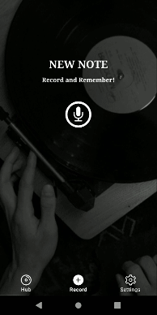
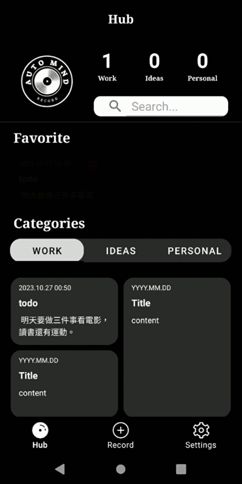
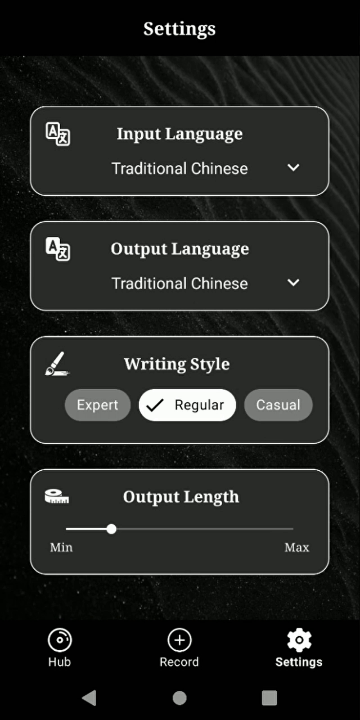

# AutoMind
APK : [Download here](https://reurl.cc/v6EQ3e)
## A note-taking app adept at converting audio into diverse formats.
### Splash

- Lottie Integration: Utilized Lottie animations for creating an engaging splash screen.

### Record

- Time & Sound Visualization: Implemented a time ticker alongside a sound visualizer to enhance the recording experience.
- Transcription Services: Integrated Google's speech-to-text SDK, OpenAI API, and Markmap SDK to convert transcriptions into concise summaries, bullet lists, and visual mindmaps.
- Mindmap Display & Sharing: Incorporated WebView and HTML for interactive mindmap presentations. Additionally, provided an option to export these mindmaps as images for effortless sharing.

### Hub

- Note History & Display: Made use of RecyclerView, Viewbinding, and TabLayout to showcase the history of notes. Organized them into various categories for easier access.
- Search Capability: Introduced a search feature, enabling users to effortlessly locate notes by their title.

### Settings

- User Customization: Integrated Spinner, ChipGroup, and Seekbar to provide a wide range of customization options, ensuring a personalized user experience. 
